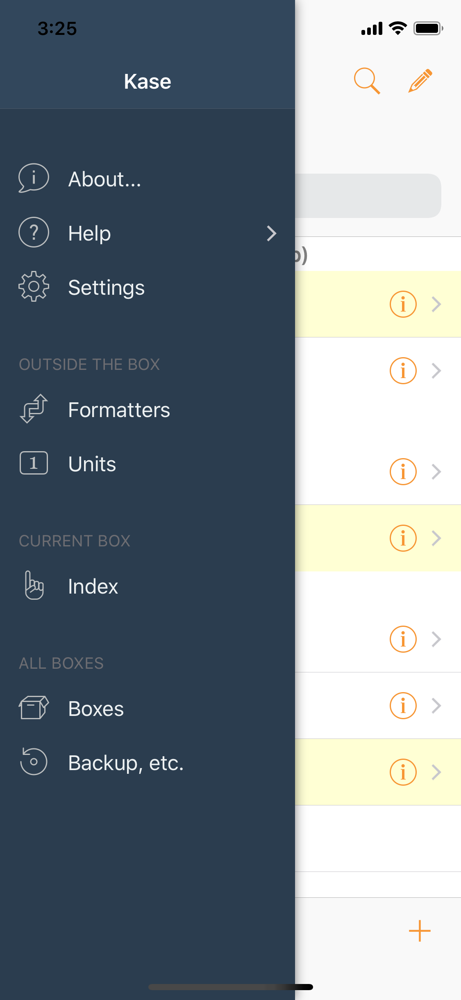

# Meet Your Kase

## The Missing PIM

To manage your personal information, the familiar four PIM \(Personal Information Manager\) are **Calendar**, **Contacts**, **Reminders**, and **Notes.**


Or, **Date Book**, **Address Book**, **To Do**, and **Notes**, very well defined since the **palm/pilot** days.


You know an appointment goes into **Calendar**. Contact info should be in **Contacts.** To-do items in **Reminders \(**or maybe **Things\)**. Any others, in **Notes**?

But what about all those pieces of data that is not an event, not a contact, not a to-do, yet have a bit more structure than just a free-form note?

Put it in you **Kase**.

