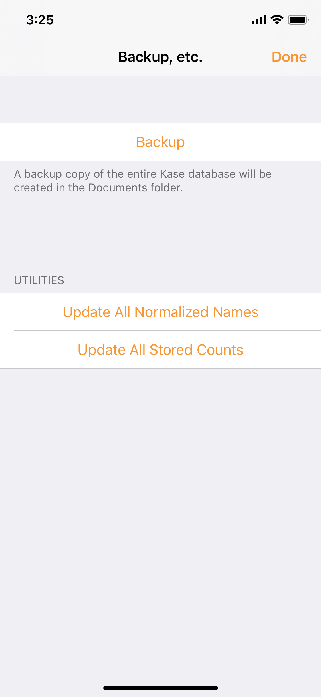

# Backup, etc.

## Backup

Tap the **Backup** button to create a copy of the entire Kase database, including all Boxes and all configured Formatters.

The copied files will be in Kase's "Documents" folder, accessible via **iTunes** or the standard iOS **Files** app.


Don't be concerned that Kase completes the backup process almost instantly, even for a database with gigabytes of data. Modem iOS devices use the new APFS \(Apple File System\), and are capable of making file copies really fast.


### In Files App

In **Browse** tab, under **Locations**, tap **On My iPhone**. Find and tap on **Kase**, then **backups**, and you should see a list of folders named by the dates of the backup.

