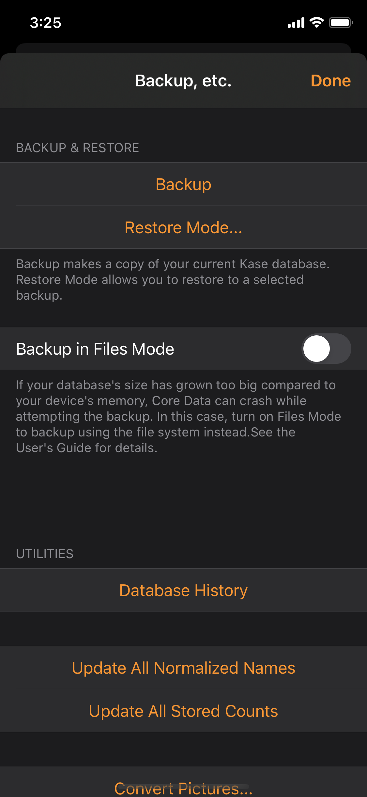
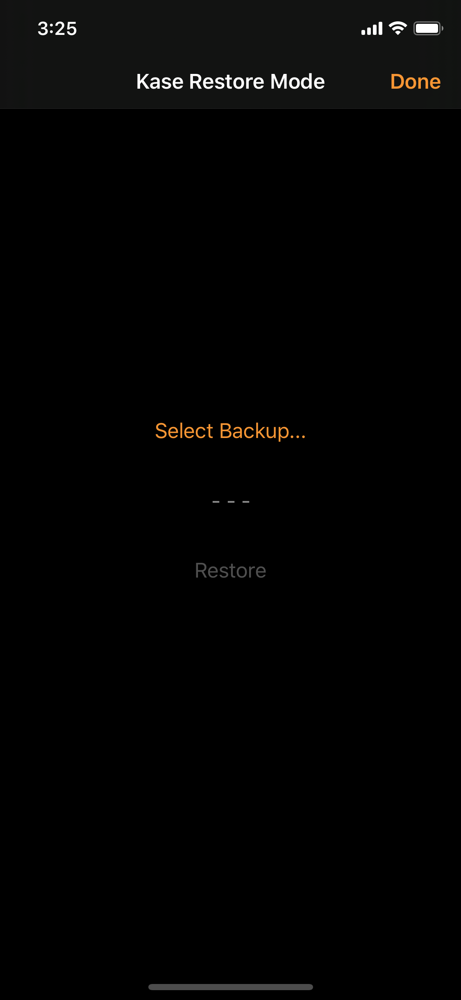
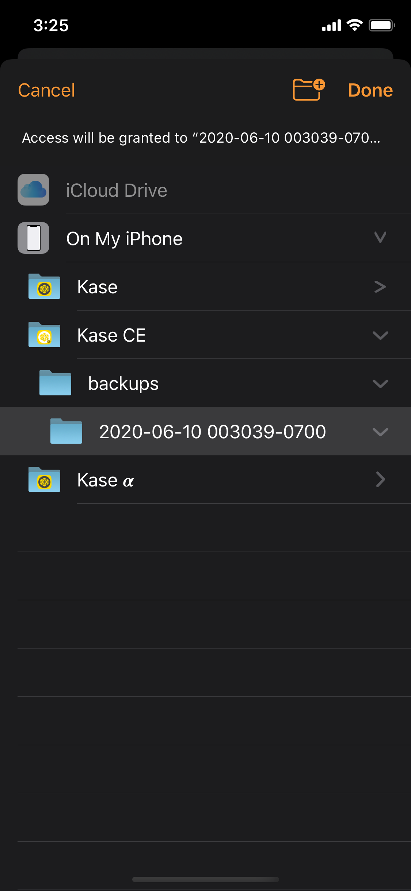
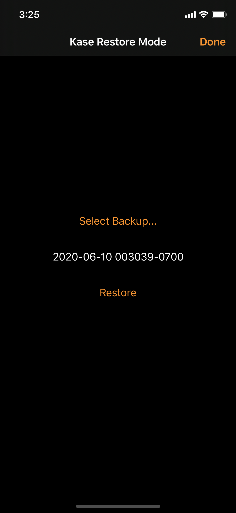

# Backup, etc.

Towards the bottom of the Side Menu is the "**Backup, etc.**" item. In addition to Backup, you will find other database utilities there.

## Backup & Restore

### Backup

Tap the **Backup** button to create a copy of your entire Kase database, including all Boxes, database history, and all configured Formatters.

The backup copy will be in the app's "**backups**" folder, accessible via **iTunes** or the standard iOS **Files** app. Note that every app has its own folder, so the _backups_ folder for Kase CE is distinct from that of the standard Kase app.


Since the **backups** folder lives alongside the app, deleting an app would also delete its backups, as warned by the iOS "Delete App" command:

"Deleting this app will also delete its data."

You can use the Files app to move or copy the backup files before deleting an app.


#### Backup in Files Mode

Kase supports two modes of backing up:

1. **Standard mode** via Core Data's Persistent Store Coordinator, and
2. **Files mode** via the file system.

Using Core Data's Store Coordinator is the official, "more proper", way to backup a Core Data database. It generates one self-contained file and its size might be smaller than the other mode's output. However, it takes longer, and is very memory hungry. It should not be a problem unless you have a very large database. It is the recommended mode and it is the default.

If you have a database that is too big in comparison to your device's memory, Core Data can crash while attempting to create a backup. \(Kase 3.1 and before didn't offer this mode for this reason.\) In this case, turn on "**Back up in Files Mode**" to backup via the file system.

Files mode utilizes the file system to create the backup. It is fast and does not require a lot of memory, but it results in more than one file that need to be used together.


Don't be concerned that Kase completes the Files Mode backup almost instantly, even for a database with gigabytes of data. Modern iOS devices use the new APFS \(Apple File System\) and are capable of making file copies really fast.


Kase's Restore function knows both of these backup modes, and will restore them with the appropriate methods.

### Restore Mode

Enter Restore Mode if you want to completely replace the current database.

To enter Restore Mode, tap the "Restore Mode..." button and confirm. The next time Kase restarts, it will enter Restore Mode.


Another way to request Restore Mode is from the Settings app's Kase page. Under Kase Settings, turn on the "Restore Mode" switch.



Quitting Kase: Swipe up from bottom of the screen to show the app switcher. Flick the Kase app window up to quit it.


In Restore Mode, tap "Select Backup..." to choose a backup to restore. A window similar to the Files app will appear allowing you to pick a backup folder. \(See note for the Files app below.\)

E.g. You can pick a backup from the CE edition of Kase and restore it to the full version of Kase. You can also restore from Kase 2 to the current version of Kase 3.

The "Restore" button will then be enabled if the backup selection is validated. Tapping the Restore button \(and the confirmation\) will start the restore process, completely replacing the current Kase database.

Tap on Done to load the database and the regular Kase UI.

### In Files App

In the **Browse** tab, under **Locations**, tap **On My iPhone** \(or **On My iPad**\). Find and tap on the **Kase** app folder, then **backups**, and you should see a list of folders named by the dates of the backup.


As of iOS 13.5, the Files app sometimes fail to show all apps. This also affects the UIDocumentPicker window from within Kase. If you cannot see the Kase app folder, restarting your device should fix it. Hopefully Apple will make this right in a future system...


