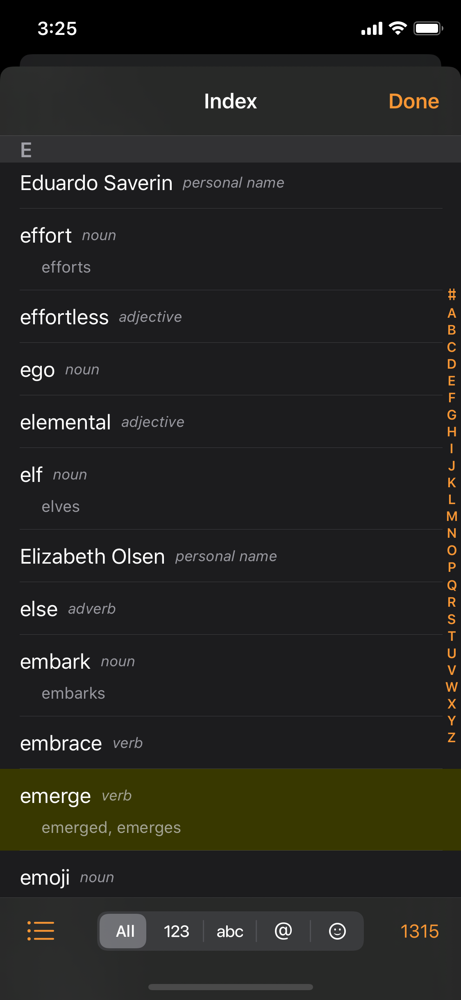

# Index

## Tool Bar Buttons

* **View** Button
* **Lexical Class** Selector
  * "**All**":

    Show All classes; no filtering.

  * "**123**":

    Show Numbers only.

  * "**abc**":

    Show Words only: including Noun, Verb, Adjective, Adverb.

  * "**@**":

    Show Names only: including Personal Name, Organization Name, Place Name.

  * "**☺︎**":

    Show Others only: non-words.
* **Count** Button
  * Displays the number of displayed words.
  * Tap to show:
    * **Clear Index**
    * **Reindex**

