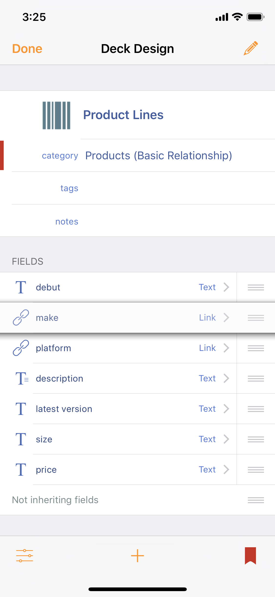

# Basic Relationship

To track companies and their products:

* Make two Decks: **Companies**, and **Product Lines**.
* In Product Lines, add a Link field called "**make**" and select Companies as the **link to deck**.

That's it.

Now that a relation is defined, any Card in Product Lines can link to a Companies card, establishing a two-way relationship, and from the other direction, any Companies card can easily browse to all Product Lines that belong to the company.

