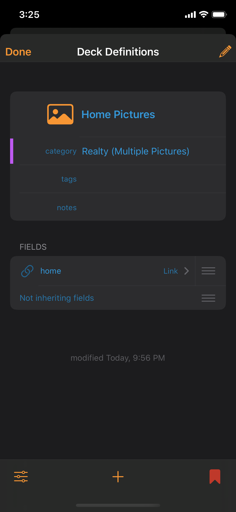
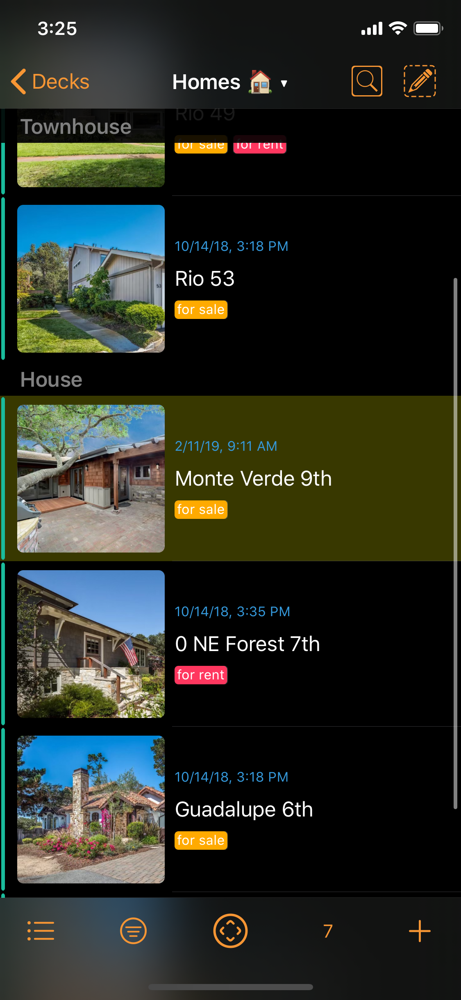
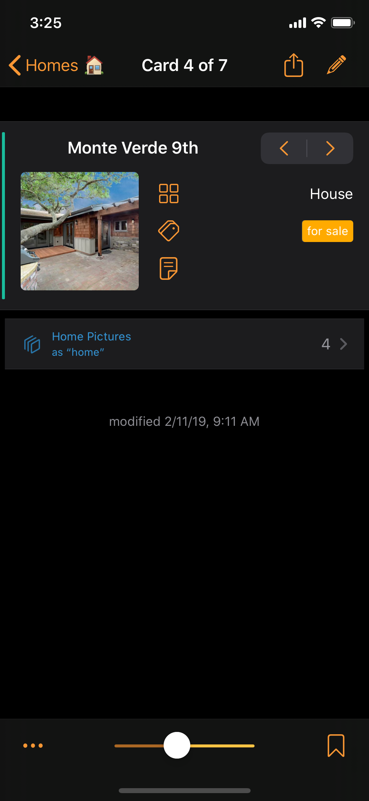

# Multiple Pictures

The same one-to-many relationship in the previous example can be used to accomplish linking one Card to multiple pictures.

For example, how does one track a real estate property and its many pictures?

## Set-up

To track homes and their pictures:

* [ ] Make a deck for **Homes.**
* [ ] Make a **Home Pictures** deck with a link field "**home**" linking to the Homes deck.















## Sample Results















