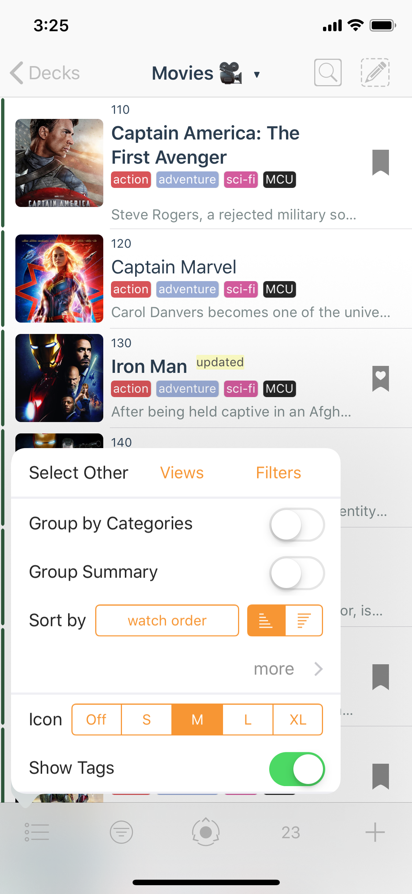

# First Look at a Deck

A Deck is a container for Cards. When you tap a Deck from the home Decks screen, you are presented with the Cards inside.

## Top Bar

* **Back** Button
* **Title** Menu
* **Search** Button
* **Edit/Select** Button

## Bottom Bar

* **View** Button
* **Filter** Button
* **Picker** Button
* **Count** Button
* **Add** Button

