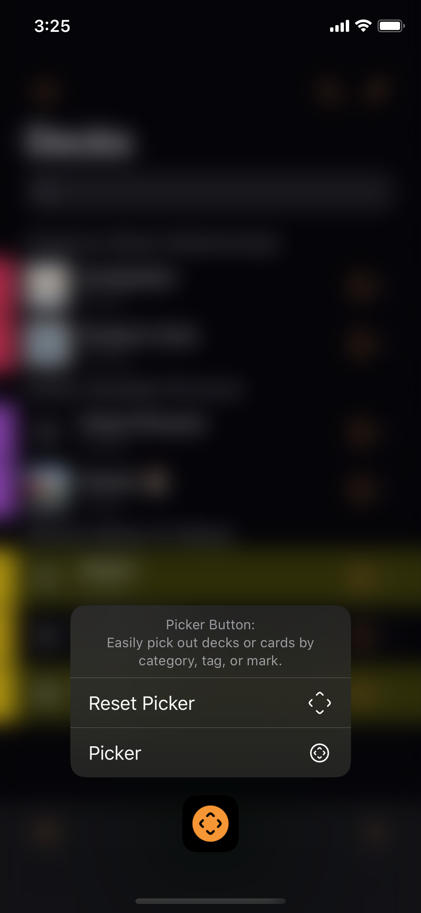
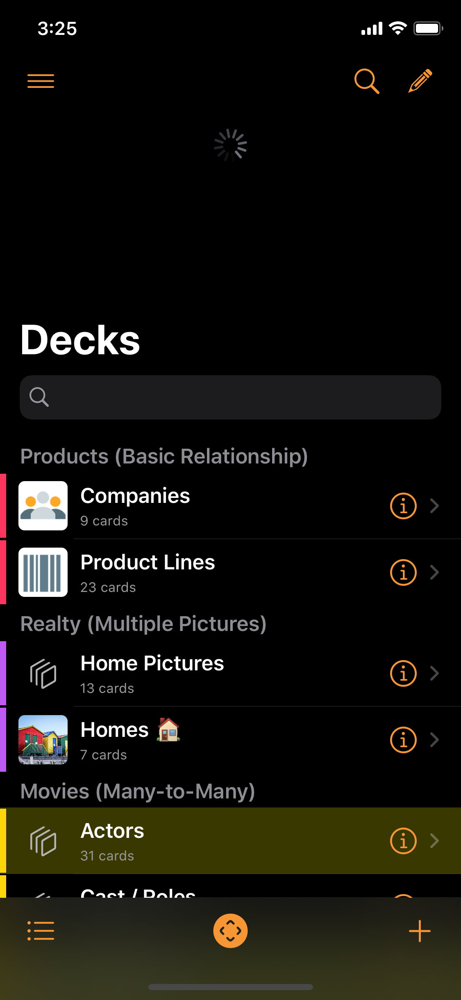

# Welcome to Kase

Kase is your data manager. It is flexible and it is simple. From a list of collectibles to an expert system or a knowledge base, you can build them with Kase.

## General

First, some basic concepts in Kase:

* Kase contains **Boxes**
* A Box holds **Decks**
* And a Deck collects **Cards**


But if you prefer "Tables" and "Records", you can customize the terminology in Settings. I told you Kase is flexible.


And before you explore around, knowing these common Kase controls will be helpful:

* If unsure, tap-and-hold on a button to see its context menu.

* Pull down on the content to refresh.

