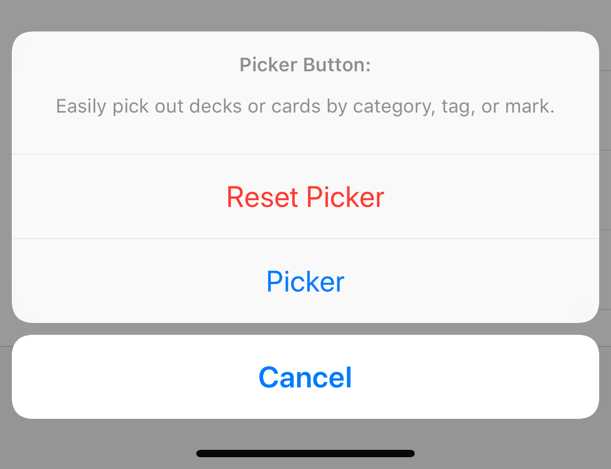

# Welcome to Kase

Kase is your data manager. It is flexible and it is simple. From a list of collectibles to an expert system or a knowledge base, you can build them with Kase.

## General

First, some common controls in Kase:

* If unsure, tap-and-hold on a button to see its available actions.

* Pull down on the content to refresh.

