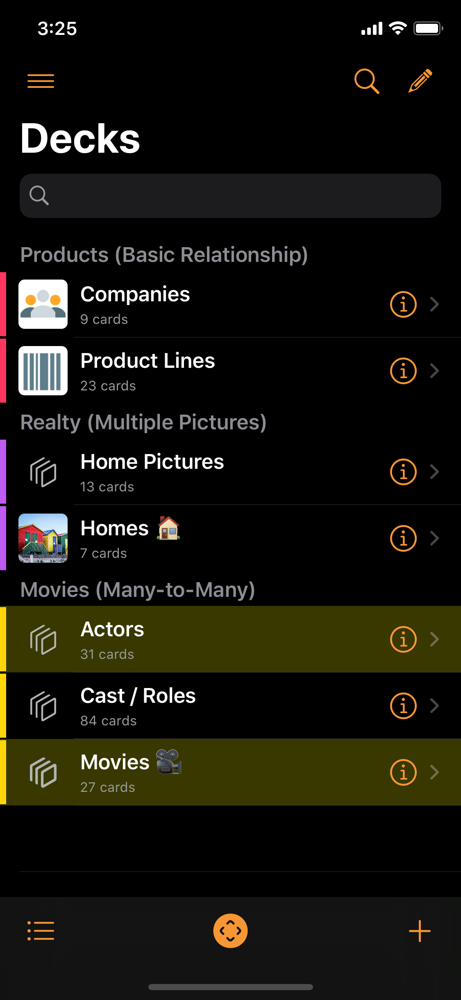
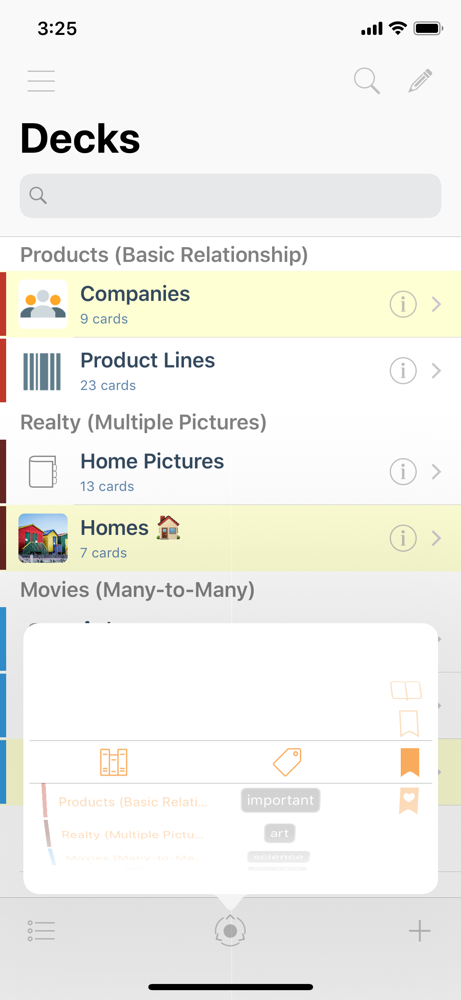
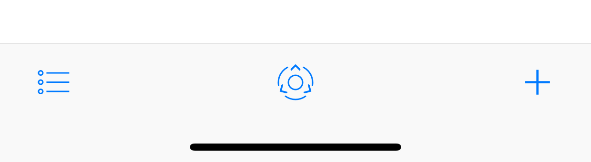

# Decks

Decks is Kase's home screen. Here you pick the deck to work with. You can also search right from here for the Card you have in mind, even if you don't know which Deck it is in.

## Buttons

* **Side Menu** Button
  * Reveal the [main menu](side-menu.md).
* **Search** Button
  * Activate search mode.
* **Edit** Button
  * Start/Exit Edit mode.

* **View** Button
  * Listing options.
* **Picker** Button
  * Allows you to easily pick out decks or cards by category, tag, or mark.
* **Add** Button
  * Add a new Deck.

