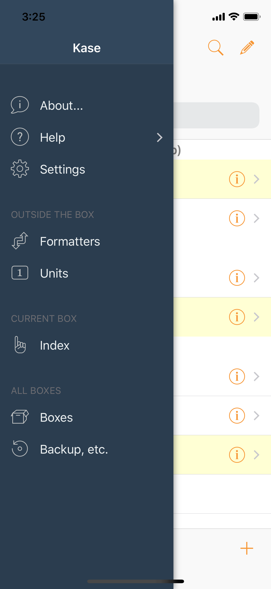

# Side Menu

Tap the **Side Menu** button on the home screen to show the Side Menu.


Or simply drag from the left edge towards the right, along the top or bottom bars, even when you are not on the home screen.


## App-Level Commands

* **About...**
  * Brings up the **About Kase** screen with version, acknowledgments, credit, and copyright information.


Tap on the Version label to reveal detailed Version/Build numbers.


* **Help**
  * Shows the Help sub-menu:
    * Documentation
    * Support
    * Import Sample Data
    * Glossary
* **Settings**
  * Brings up **Kase Settings** where you can customize how Kase works.

## Outside the Box

* **Formatters**
  * Brings up the **Formatters** screen where you can manage the Formatters available for formatting data output.
* **Units**
  * Brings up the **Units** screen where you can quickly find supported units for unit conversions, either interactively or via **UnitConverter**, one of the built-in formatters.

## Current Box

* **Index**
  * Brings up the **Index** for the current Box, showing indexed keywords that can be used for searching.

## All Boxes

* **Boxes**
  * Brings up the **Boxes** screen where you can switch to another Box, or manage the Boxes in your Kase.
* **Backup, etc.**
  * Brings up the **Backup, etc.** screen where all database utilities reside.

